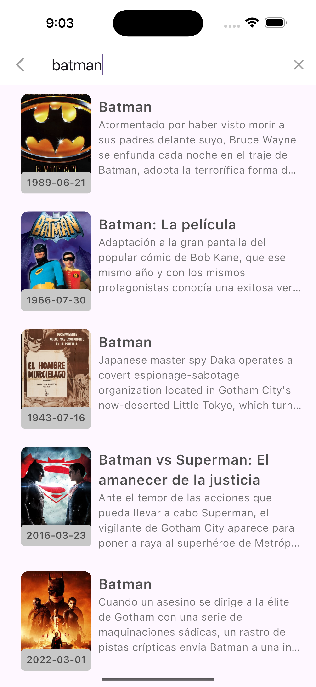
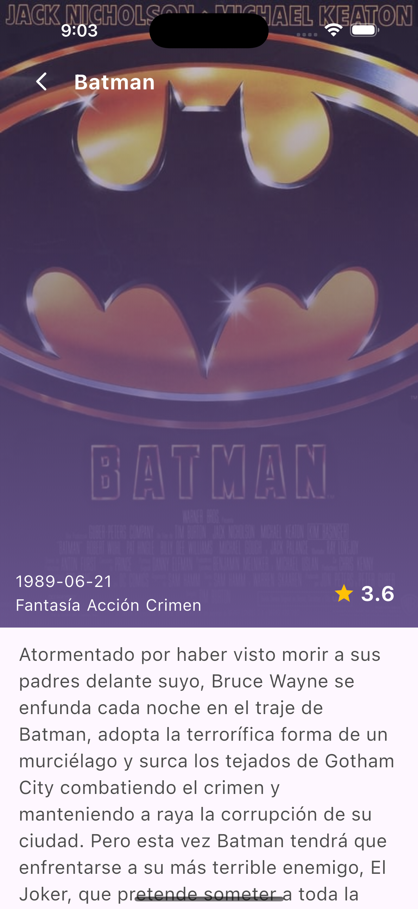

#  the_movie_db


## Como usarlo
**Paso 1:**

Descargar o clonar este respositorio usando este link:

```
https://github.com/AlejandroRodriguezO/TheMovieDB.git
```

**Paso 2:**

Vaya a la raíz del proyecto y ejecute el siguiente comando en la consola para obtener las dependencias necesarias:

```
flutter clean
```
```
flutter pub get
```
**Paso 3:**

Ejecutar el comando para mantener el código fuente sincronizado automáticamente:

```
dart run build_runner build --delete-conflicting-outputs
```

**Paso 4:**

En caso de ejecutar pruebas puede realizarlo con el comando:

```
flutter test 
```

### anexo imagen de covertura


### Folder Structure
Ésta es la estructura de carpetas que nos proporciona flutter.

```
superlikers/
|- android
|- assets
|- build
|- ios
|- lib
|- test
```

Ésta es la estructura de carpetas que hemos estado usando en este proyecto.

```
lib/
|- core/
  |- constants/
    |- enums/
    |- utils/
  |- data/
    |- models/
  |- di/
  |- domain/
    |- entities/
    |- usecases/
  |- presentation/
    |- app/
|- features/
  |- detail/
    |- data/
      |- datasources/
      |- models/
      |- repositories/
    |- domain/
      |- entities/
      |- repositories/
      |- usecases/
    |- presentation/
      |- cubit/
      |- screen/
      |- widgets/
  |- home/
    |- data/
      |- datasources/
      |- models/
      |- repositories/
    |- domain/
      |- entities/
      |- repositories/
      |- usecases/
    |- presentation/
      |- cubit/
      |- screen/
      |- widgets/
  |- search/
    |- data/
      |- datasources/
      |- models/
      |- repositories/
    |- domain/
      |- entities/
      |- repositories/
      |- usecases/
    |- presentation/
      |- cubit/
      |- screen/
      |- widgets/
```


### Anexo imagenes del funcionamiento

  <table>
    <tbody>
    <tr>
        <th><Strong>home</Strong></th>
        <th><Strong>search</Strong></th>
      </tr>
        <tr>
            <td> </td>
            <td> </td>
        </tr>
     </tr>   
    <tr>
        <th><Strong>search movie</Strong></th>
        <th><Strong>detail</Strong></th>
      </tr>
        <tr>
            <td> </td>
            <td> </td>
        </tr>
     </tr>   
    <tr>
        <th><Strong>detail movie</Strong></th>
      </tr>
        <tr>
            <td> </td>
        </tr>
     </tr>   
    </tbody>
  </table>


